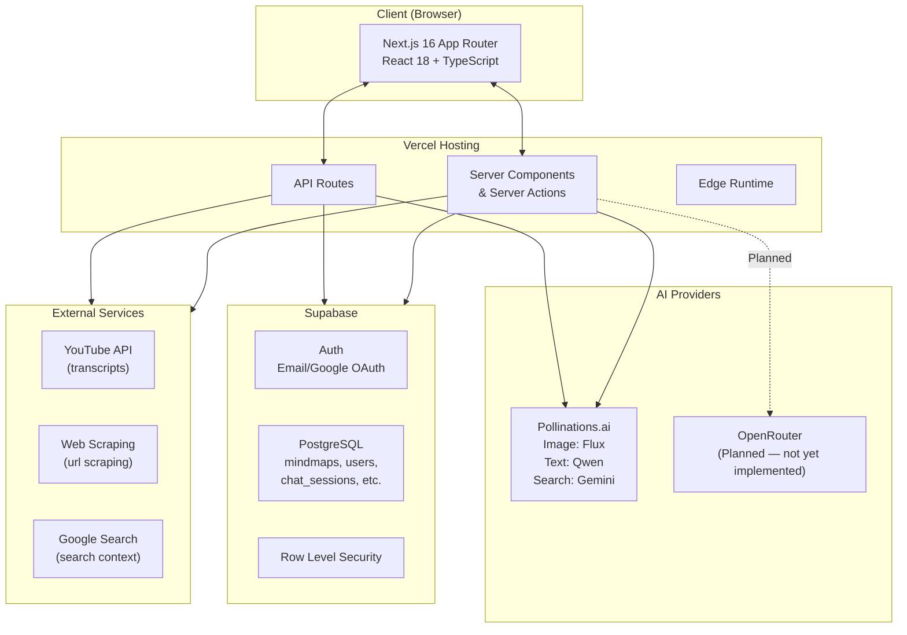
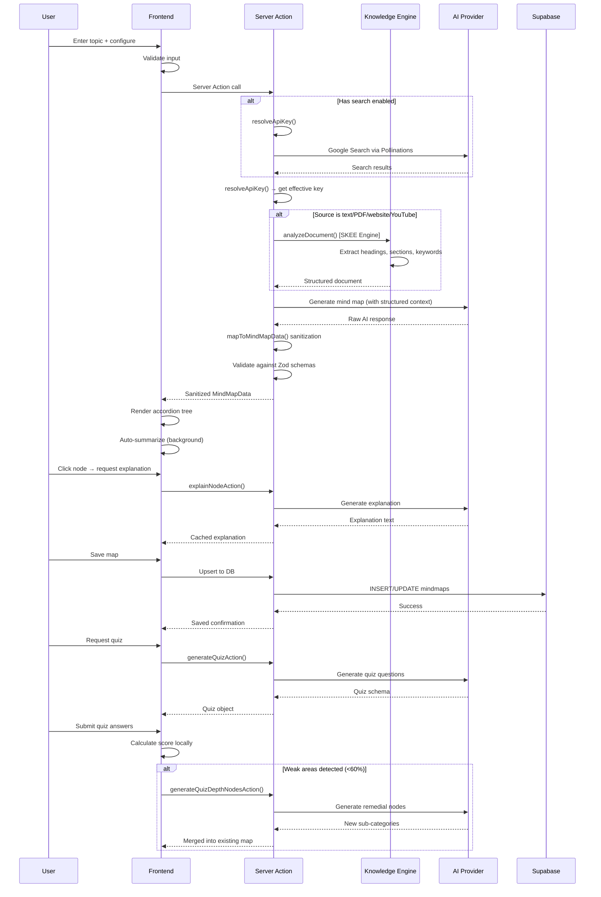
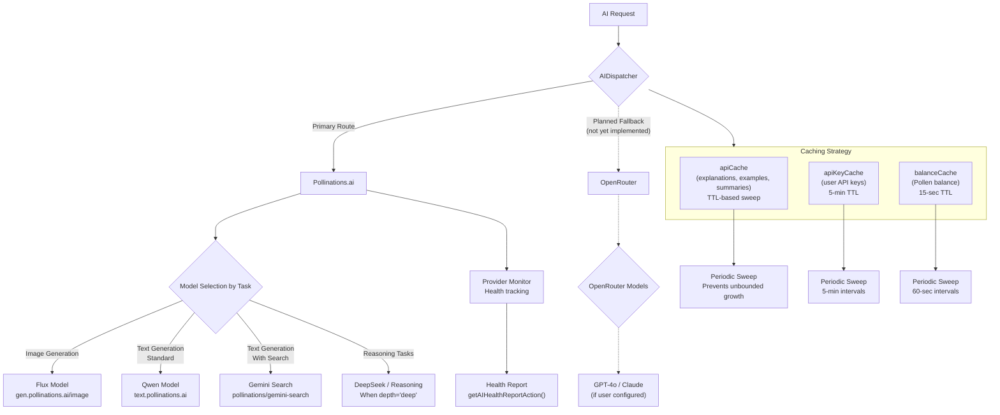
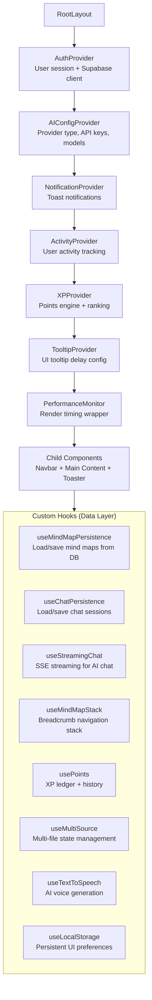
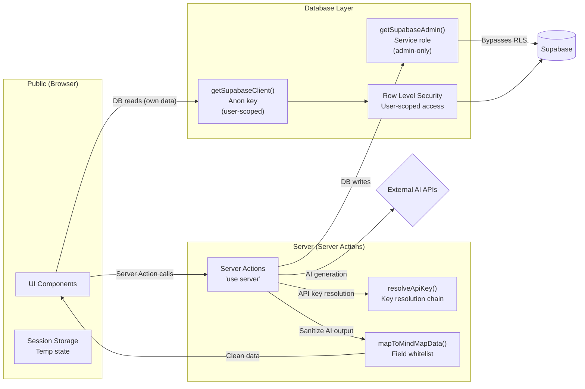

# 🏗️ MindScape — Full-Stack Architecture Diagram

Complete system architecture covering all layers from user interface to external providers.

---

## Layer 1: Top-Level View



---

## Layer 2: Full Component Map

```mermaid
flowchart LR
    %% ─── INPUTS ───
    USER((👤 User)) --> HOME[<b>Home Page</b><br/><code>/</code>]

    HOME --> INPUT{Input Type}
    INPUT -->|Text Topic| TEXT["Enter topic text"]
    INPUT -->|PDF| PDF["Upload PDF<br/>pdf.js parsing"]
    INPUT -->|Image| IMG["Upload Image<br/>base64 + resize"]
    INPUT -->|YouTube URL| YT["YouTube transcript<br/>extraction"]
    INPUT -->|Website URL| WEB["Web scraping<br/>content extraction"]
    INPUT -->|Multi-Source| MULTI["Multiple sources<br/>merged via useMultiSource"]

    TEXT --> NAV
    PDF --> NAV
    IMG --> NAV
    YT --> NAV
    WEB --> NAV
    MULTI --> NAV

    NAV{Navigate to Canvas} --> CANVAS[<b>Canvas Page</b><br/><code>/canvas</code>]

    CANVAS --> MM[<b>MindMap Component</b><br/>Main visualization]
    CANVAS --> CP[<b>ChatPanel Component</b><br/>Sliding AI chat]
    CANVAS --> ONB[<b>OnboardingWizard</b><br/>First-time guide]

    MM --> ACC[Accordion Tree View<br/>Expandable hierarchy]
    MM --> MAP[Map View<br/>Radial graph portal]
    MM --> COMPARE[Compare View<br/>Side-by-side analysis]

    ACC --> DIALOGS{Dialogs}

    DIALOGS --> EXP[Explanation Dialog<br/>3 levels + micro-quiz]
    DIALOGS --> SUM[Summary Dialog<br/>AI summary + audio TTS]
    DIALOGS --> GALLERY[Image Gallery<br/>Generated visuals]
    DIALOGS --> NESTED[Nested Maps Dialog<br/>Sub-map tree]
    DIALOGS --> PRACTICE[Practice Questions<br/>Related questions]
    DIALOGS --> AI_CONTENT[AI Content Dialog<br/>All AI outputs]
    DIALOGS --> IMG_LAB[Visual Insight Lab<br/>AI image generation]

    %% ─── SERVER ACTIONS ───
    MM --> ACTIONS{Server Actions}
    CP --> ACTIONS

    ACTIONS --> GMM[generateMindMapAction<br/>Text & search-based maps]
    ACTIONS --> GIMM[generateMindMapFromImageAction<br/>Vision-to-map]
    ACTIONS --> GPF[generateMindMapFromPdfAction<br/>PDF-to-map]
    ACTIONS --> GTXT[generateMindMapFromTextAction<br/>Text-to-map]
    ACTIONS --> GYT[generateYouTubeMindMapAction<br/>Video-to-map]
    ACTIONS --> GWEB[generateMindMapFromWebsiteAction<br/>Web-to-map]
    ACTIONS --> GCOMP[generateComparisonMapAction<br/>Compare mode]
    ACTIONS --> CHAT[chatAction<br/>AI chat + streaming]
    ACTIONS --> QUIZ[generateQuizAction<br/>Quiz generation]
    ACTIONS --> EXPL[explainNodeAction<br/>Node explanation]
    ACTIONS --> EXMP[explainWithExampleAction<br/>Real-world example]
    ACTIONS --> SUMM[summarizeTopicAction<br/>Map summarization]
    ACTIONS --> TRANS[translateMindMapAction<br/>Language translation]
    ACTIONS --> IMG_API[/api/generate-image<br/>Image generation endpoint]
    ACTIONS --> SCRAPE[/api/scrape-url<br/>URL scraping endpoint]

    %% ─── AI FLOWS ───
    GMM --> AI_FLOWS{AI Flow Layer}
    GIMM --> AI_FLOWS
    GPF --> AI_FLOWS
    GTXT --> AI_FLOWS
    GYT --> AI_FLOWS
    GWEB --> AI_FLOWS
    GCOMP --> AI_FLOWS
    CHAT --> AI_FLOWS
    QUIZ --> AI_FLOWS
    EXPL --> AI_FLOWS
    EXMP --> AI_FLOWS
    SUMM --> AI_FLOWS
    TRANS --> AI_FLOWS

    subgraph AI_FLOWS["AI Flow Layer"]
        F1["generate-mind-map<br/>General purpose"]
        F2["generate-mind-map-from-image<br/>Vision analysis"]
        F3["generate-mind-map-from-pdf<br/>Document analysis"]
        F4["generate-mind-map-from-text<br/>Text synthesis"]
        F5["youtube-mindmap<br/>Video transcripts"]
        F6["generate-mind-map-from-website<br/>Web content"]
        F7["compare/flow<br/>Topic comparison"]
        F8["chat-with-assistant<br/>Conversational AI"]
        F9["generate-quiz<br/>Quiz generation"]
        F10["explain-mind-map-node<br/>Node explanation"]
        F11["summarize-topic<br/>Map summary"]
        F12["translate-mind-map<br/>Translation"]
        F13["enhance-image-prompt<br/>Prompt engineering"]
        F14["explain-with-example<br/>Real-world analogies"]
        F15["synthesize-nodes<br/>Knowledge fusion"]
    end

    %% ─── KNOWLEDGE ENGINE ───
    AI_FLOWS --> SKEE[<b>SKEE Engine</b><br/>Structural Knowledge Extraction]

    subgraph SKEE["Knowledge Engine (Deterministic)"]
        HEAD[Heading Detector<br/>Identifies doc structure]
        SECT[Section Splitter<br/>Logical sections]
        CONCEPT[Concept Extractor<br/>Key concepts]
        REL[Relationship Detector<br/>Concept relationships]
        KW[Keyword Extractor<br/>Meaningful keywords]
        GRAPH[Graph Builder<br/>Structural graph]
    end

    %% ─── CLIENT DISPATCHER ───
    AI_FLOWS --> DISPATCH[<b>AI Dispatcher</b><br/>Routes to provider]

    DISPATCH --> POLL_A["Pollinations Client<br/>Primary provider"]
    DISPATCH -.->|Planned| OR_A["OpenRouter Client<br/>Not yet implemented"]
    DISPATCH --> MONITOR["Provider Monitor<br/>Health tracking"]

    POLL_A --> POLL_API{External APIs}
    OR_A -.-> POLL_API

    POLL_API --> GEN_IMG["gen.pollinations.ai<br/>Image generation"]
    POLL_API --> GEN_TEXT["text.pollinations.ai<br/>Text generation"]

    %% ─── SCHEMA VALIDATION ───
    AI_FLOWS --> SCHEMAS[<b>Schema Validation</b><br/>Zod schemas]

    SCHEMAS --> VALIDATED[Validated Outputs]

    VALIDATED --> SANITIZE[<b>mapToMindMapData</b><br/>Sanitization Layer]

    SANITIZE --> RENDER_MM[Render in MindMap Component]

    %% ─── PERSISTENCE ───
    RENDER_MM --> PERSIST{Persistence Layer}

    subgraph PERSIST["Persistence"]
        SUPABASE_DB["Supabase DB<br/>mindmaps, users,<br/>chat_sessions,<br/>shared_mindmaps"]
        SESSION_STORE["Session Storage<br/>Client-side cache<br/>for navigation"]
        API_CACHE["In-Memory Cache<br/>Server-side<br/>explanations, summaries"]
        API_KEY_CACHE["API Key Cache<br/>5-min TTL<br/>Avoids repeated reads"]
    end

    SUPABASE_DB --> RLS[Row Level Security<br/>User-scoped access]
    SUPABASE_DB --> AUTH_SERVICE["Auth Service<br/>JWT + sessions"]

    %% ─── ADMIN ───
    SUPABASE_DB --> ADMIN[Admin Dashboard<br/>Server-only access]
    ADMIN --> ADMIN_UI[<b>Admin Page</b><br/><code>/admin</code>]

    %% ─── COMMUNITY ───
    SUPABASE_DB --> COMMUNITY[<b>Community Page</b><br/><code>/community</code>]
    SUPABASE_DB --> LIBRARY[<b>Library Page</b><br/><code>/library</code>]

    %% ─── PROFILE ───
    SUPABASE_DB --> PROFILE[<b>Profile Page</b><br/><code>/profile</code>]
    PROFILE --> XP[XP Engine<br/>Points & ranks]
    PROFILE --> STATS[User Statistics<br/>Maps, chats, nodes]

    %% ─── CONTEXTS (App-wide State) ───
    subgraph CONTEXTS["React Contexts (App-wide State)"]
        AUTH_CTX["AuthContext<br/>User session, login/logout"]
        AI_CFG["AIConfigContext<br/>Provider config, API keys"]
        XP_CTX["XPContext<br/>Points, ranks, streaks"]
        NOTIFY_CTX["NotificationContext<br/>Toast notifications"]
        ACTIVITY_CTX["ActivityContext<br/>User activity tracking"]
    end

    AUTH_CTX --- CP
    AUTH_CTX --- MM
    AI_CFG --- CP
    AI_CFG --- MM
    XP_CTX --- MM
    XP_CTX --- CP
    NOTIFY_CTX --- CP
    NOTIFY_CTX --- MM
```

---

## Layer 3: Data Flow (Request Lifecycle)



---

## Layer 4: Provider & Model Strategy



---

## Layer 5: Database Schema

```mermaid
erDiagram
    users ||--o{ mindmaps : creates
    users ||--o{ chat_sessions : has
    users ||--o{ shared_mindmaps : shares
    users ||--o{ user_settings : configures
    users ||--o{ user_events : logs
    users ||--o{ user_profiles : profiles
    users ||--o{ user_points : points
    users ||--o{ point_transactions : transactions
    users ||--o{ feedback : submits
    users ||--o{ user_daily_challenges : challenges

    users {
        uuid id PK
        text email
        text display_name
        text photo_url
        boolean is_admin
        jsonb preferences
        jsonb statistics
        jsonb activity
        text[] unlocked_achievements
        timestamp created_at
        timestamp updated_at
    }

    user_settings {
        uuid user_id PK FK
        text pollinations_api_key
        text image_model
        text text_model
        bigint api_key_created_at
        bigint api_key_last_used
    }

    user_events {
        bigint id PK
        uuid user_id FK
        text event_type
        jsonb event_data
        text source
        text ip_address
        text user_agent
        text session_id
        timestamptz created_at
    }

    user_profiles {
        uuid user_id PK FK
        text email
        text display_name
        text photo_url
        timestamptz created_at
        int total_maps
        int total_compare_maps
        int total_multi_maps
        int total_chats
        int total_nodes
        int total_images
        int total_expansions
        int study_time_minutes
        int current_streak
        int longest_streak
        date last_active_date
        jsonb mode_breakdown
        jsonb depth_breakdown
        jsonb source_breakdown
        jsonb persona_breakdown
        jsonb daily_activity
        text[] unlocked_achievements
        timestamptz updated_at
    }

    platform_stats {
        text id PK default "global"
        int total_users
        int total_maps
        int total_maps_ever
        int total_chats
        int total_nodes
        int total_images
        bigint total_events
        int new_users_24h
        int new_maps_24h
        int active_users_24h
        int active_users_7d
        int new_users_7d
        int new_maps_7d
        int health_score
        double precision engagement_rate
        text top_persona
        text top_source_type
        double precision avg_maps_per_user
        double precision avg_nodes_per_map
        jsonb daily_snapshot
        timestamptz updated_at
    }

    mindmaps ||--o{ mindmaps : "parent/child (nested)"
    mindmaps {
        uuid id PK
        uuid user_id FK
        text topic
        text summary
        text mode
        text depth
        text ai_persona
        int node_count
        boolean is_public
        boolean is_shared
        boolean is_sub_map
        uuid parent_map_id FK
        jsonb content
        jsonb pinned_messages
        text thumbnail_url
        text thumbnail_prompt
        text source_url
        text source_file_type
        text video_id
        jsonb search_sources
        text search_timestamp
        timestamp created_at
        timestamp updated_at
    }

    shared_mindmaps {
        text id PK
        uuid original_author_id FK
        uuid original_map_id
        text author_name
        text author_avatar
        text topic
        text summary
        jsonb content
        boolean is_shared
        boolean is_public
        text[] public_categories
        int views
        timestamp shared_at
        timestamp updated_at
    }

    public_mindmaps {
        text id PK
        uuid original_map_id
        uuid original_author_id FK
        text author_name
        text author_avatar
        text topic
        text summary
        jsonb content
        boolean is_public
        text[] public_categories
        int views
        int public_views
        text depth
        text thumbnail_url
        text short_title
        timestamp published_at
        timestamp updated_at
    }

    chat_sessions {
        uuid id PK
        uuid user_id FK
        uuid map_id FK
        text title
        text map_title
        jsonb messages
        jsonb quiz_history
        text weak_tags
        jsonb pinned_messages
        timestamp created_at
        timestamp updated_at
    }

    user_points {
        uuid user_id PK FK
        jsonb ledger
        jsonb daily_caps
        jsonb history_days
        timestamptz updated_at
    }

    point_transactions {
        uuid id PK
        uuid user_id FK
        text event_type
        int base_points
        int bonus_points
        int total_points
        double precision multiplier
        bigint timestamp
        jsonb metadata
    }

    feedback {
        uuid id PK
        uuid user_id FK
        text type
        text title
        text description
        text status
        timestamp created_at
        timestamp resolved_at
    }

    ai_calls {
        bigint id PK
        text task_type
        text provider
        text model
        int duration_ms
        boolean was_error
        text error_message
        text prompt
        uuid user_id FK
        boolean repair_applied
        boolean salvaged
        jsonb metadata
        timestamptz created_at
    }

    admin_activity_log {
        uuid id PK
        text type
        uuid target_id
        text target_type
        text details
        uuid performed_by FK
        text performed_by_email
        jsonb metadata
        timestamptz timestamp
    }

    user_daily_challenges {
        uuid id PK
        uuid user_id FK
        text date_string
        uuid map_id
        int xp_awarded
        timestamptz completed_at
    }
```

### Database Migration Files

| File | Description |
|---|---|
| `20260614150709_initial_schema.sql` | Placeholder for initial schema (remote pull needed) |
| `20260621000001_user_events_tables.sql` | Creates user_events, user_profiles, platform_stats tables + recompute functions |
| `20260621000002_recompute_cron.sql` | Enables pg_cron: 5-min incremental recompute + 6-hr full recompute |
| `20260621000003-05_*_fix_*.sql` | Fixes for node count fallback, sub-map filtering, health score alignment |
| `20260621000006_recompute_health_score.sql` | Aligns health score formula with admin-sync |
| `20260621000007_recompute_user_profile_filter_submaps.sql` | Excludes sub-maps from user profile totals |
| `20260621000008-10_*_trigger.sql` | DB triggers: auto-log map created/updated/deleted to user_events |
| `20260621000011_recompute_handle_map_deleted.sql` | Handles map deletion events in recompute |
| `20260621000012_drop_admin_stats.sql` | Drops deprecated admin_stats table |
| `20260621000013_unify_user_profiles.sql` | Unifies user_profiles schema |
| `20260624000001_telemetry_tables.sql` | Adds telemetry tables |
| `20260705000001_forking_and_challenges.sql` | Adds forking + daily challenge tables |

---

## Layer 6: Key AI Flows Detail

```mermaid
flowchart LR
    subgraph IMAGE_FLOW["Image → Mind Map"]
        IA[Upload Image] --> IA1["resizeImage()<br/>Max 2048px"]
        IA1 --> IA2["analyzeImageContentAction()<br/>OCR + description"]
        IA2 --> IA3["generateMindMapFromImage()<br/>Vision-capable AI"]
        IA3 --> IA4["mapToMindMapData()<br/>Sanitize & validate"]
        IA4 --> IA5["Render in Canvas"]
    end

    subgraph YT_FLOW["YouTube → Mind Map"]
        YA[Paste YouTube URL] --> YA1["extractYouTubeId()"]
        YA1 --> YA2["getYouTubeTranscript()<br/>Fetch captions"]
        YA2 --> YA3["generateYouTubeMindMap()<br/>Transcript analysis"]
        YA3 --> YA4["mapToMindMapData()"]
        YA4 --> YA5["Render in Canvas"]
    end

    subgraph COMPARE_FLOW["Compare → Mind Map"]
        CA["Topic 1 + Topic 2"] --> CA1["resolveApiKey()"]
        CA1 --> CA2{"Search enabled?"}
        CA2 -->|Yes| CA3["generateSearchContext()<br/>Parallel for both topics"]
        CA3 --> CA4
        CA2 -->|No| CA4["generateComparisonMapV2()"]
        CA4 --> CA5["mapToMindMapData()"]
        CA5 --> CA6["CompareView Rendering<br/>Nexus + Dimensions + Horizon"]
    end

    subgraph QUIZ_FLOW["Quiz → Adaptive Deepening"]
        QA["generateQuizAction()"] --> QB["Quiz rendered in Chat"]
        QB --> QC["User submits answers"]
        QC --> QD["Calculate per-tag scores"]
        QD --> QE{"Weak section found<br/>(<60%)?"}
        QE -->|Yes| QF["generateQuizDepthNodesAction()"]
        QF --> QG["onUpdate() → Merge new nodes<br/>into existing mind map"]
        QG --> QH["Auto-open affected branches"]
        QE -->|No| QI["Perfect or strong score<br/>→ Bonus XP"]
    end
```



---

## Layer 7: Context & State Architecture



---

## Layer 8: Security & Data Flow Boundaries



---

## Complete Deployment Architecture

```mermaid
flowchart TB
    DNS["DNS: mindscape-free.vercel.app"] --> VERCEL_EDGE[Vercel Edge Network]

    subgraph VERCEL["Vercel Deployment"]
        direction TB
        STATIC["Static Assets<br/>CSS, JS, Fonts, Images"]
        SSR["Next.js SSR<br/>Server Components"]
        SA["Server Actions<br/>API replacements"]
        API_R["API Routes<br/>/api/generate-image<br/>/api/scrape-url<br/>/api/chat/stream"]
    end

    VERCEL_EDGE --> VERCEL

    SA --> SUPABASE_DB[Supabase<br/>PostgreSQL]
    SA --> POLLINATIONS[Pollinations.ai<br/>Image + Text APIs]
    SA -.-> OPENROUTER[OpenRouter<br/>Fallback AI (Planned)]
    SA --> GOOGLE[Google APIs<br/>YouTube transcripts]
    SA --> WEB_SCRAPE[Web Scraping<br/>URL content extraction]

    STATIC --> CDN[Vercel CDN<br/>Global edge caching]

    SUPABASE_DB --> AUTH_SVC[Supabase Auth<br/>JWT + Sessions]

    CLIENT["Client Browser<br/>React 18"] --> VERCEL_EDGE
```

---

## Summary of Architecture Decisions

| Decision | Rationale |
|---|---|
| **Server Actions over REST API** | Co-locates logic with pages, no serialization overhead, type-safe end-to-end |
| **Deterministic pre-processing (SKEE)** | Eliminates hallucinated structure before AI ever sees the content |
| **Explicit field mapping in `mapToMindMapData()`** | No `...raw` spread — prevents AI property injection |
| **In-memory server caches with sweep intervals** | Avoids repeated Supabase reads without unbounded memory growth |
| **Session Storage for client-side nav** | Survives page navigation without SSR/API round-trips |
| **Pollinations.ai as sole provider** | Zero-cost for images (Flux). OpenRouter fallback is planned but not yet implemented |
| **React Contexts for app-wide state** | Auth + Config + Notifications + Activity + XP need global access |
| **Supabase RLS for data access** | Every DB query is user-scoped at the database level |
| **BYOP (Bring Your Own Pollen)** | Users bring their own API key — no platform cost for AI |
| **Session Storage for session-based generation** | File content, URL data, and session params survive navigation without server round-trips |
| **In-memory rate limiting** | Per-endpoint rate limits with auto-eviction; works best-effort in serverless |
| **DB Triggers for event capture** | `mindmaps` table triggers auto-log to user_events, preventing missed analytics when app code fails |
| **pg_cron for stats recompute** | Every 5 minutes for active profiles + platform stats; full recompute every 6 hours |

---

## 📚 Reference Handbooks

For detailed implementation and operational information, refer to:
- [Website Feature Blueprint](blueprint.md) — Comprehensive feature maps and flows
- [Component Inventory](COMPONENT_INVENTORY.md) — Grid of all UI and map components
- [API & Actions Reference](API_REFERENCE.md) — Input/output schema specs
- [Security Audit Register](SECURITY_AUDIT.md) — RLS policies, diagnostics, and vulnerabilities
- [Performance Optimization Audit](PERFORMANCE_AUDIT.md) — Bundle, caching, and canvas analysis
- [Technical Debt Registry](TECHNICAL_DEBT.md) — Compilation, hook, and code health logs
- [Product Improvement Roadmap](IMPROVEMENT_ROADMAP.md) — Future timeline plan
- [Page-by-Page Walkthrough](PAGE_WISE_WALKTHROUGH.md) — Detailed page-by-page user experience guide
- [Onboarding Flow](ONBOARDING_FLOW.md) — User onboarding paths for 3 personas
- [Admin Data Flow](ADMIN_DATA_FLOW.md) — Admin dashboard data pipeline
- [Developer Onboarding Guide](DEVELOPER_ONBOARDING.md) — New developer setup and codebase navigation
- [Deployment Handbook](DEPLOYMENT_HANDBOOK.md) — Production deployment and maintenance
- [Testing Guide](TESTING_GUIDE.md) — Test strategy, writing tests, CI integration
- [Design System](DESIGN_SYSTEM.md) — Color tokens, typography, animations, component patterns
- [Coding Standards](CODING_STANDARDS.md) — Code convention and folder standards
- [Pitch Deck](PITCH_DECK.md) — Product pitch deck
- [Documentation Coverage](DOCUMENTATION_COVERAGE_REPORT.md) — Document coverage audit & operational gap analysis
