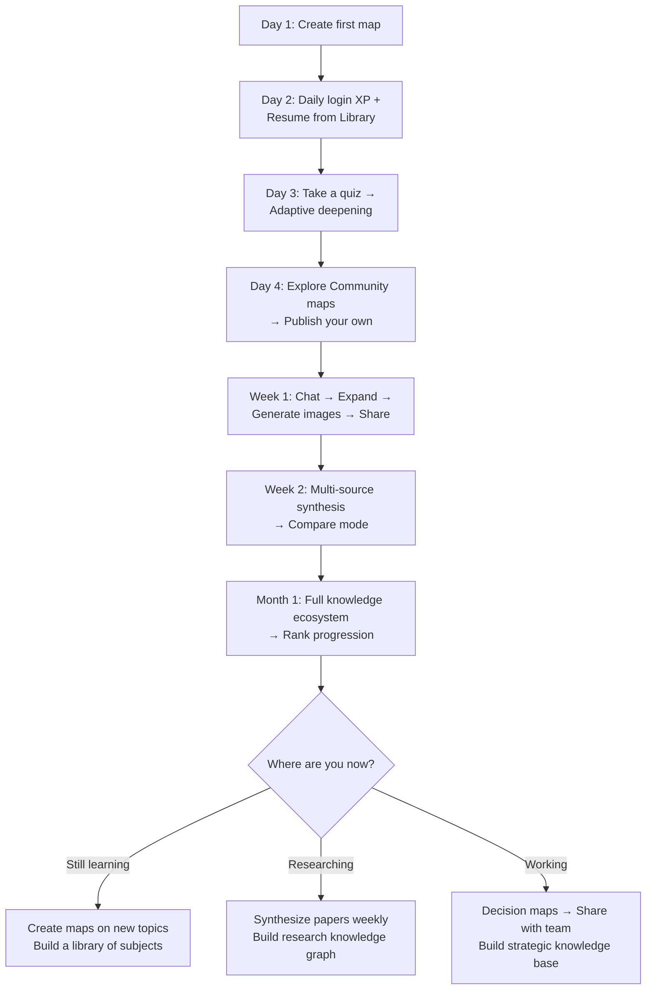

# 🌱 MindScape — User Onboarding Flow Diagram

## Three Personas, One Platform

```mermaid
flowchart TD
    START([User Arrives on Homepage]) --> LANDING{Has Account?}
    
    LANDING -->|No| SIGNUP[Sign Up / Sign In]
    LANDING -->|Yes| LOGIN[Log In]
    
    SIGNUP --> ONBOARD_BEGIN{Onboarding Wizard<br>Auto-Triggers}
    LOGIN --> ONBOARD_BEGIN
    
    ONBOARD_BEGIN --> O1[Step 1: Welcome<br>✨ "Master Your Mind"]
    O1 --> O2{Step 2: Cloud Sync}
    O2 -->|Not Logged In| O2A[See Sign-In Prompt]
    O2A --> AUTH_ACTION[Sign In via<br>Email/Password or Google OAuth]
    AUTH_ACTION --> O2B
    O2 -->|Already Logged In| O2B[✓ Identity Verified]
    O2B --> O3{Step 3: Connect API Key}
    
    O3 -->|No Key| O3A[Connect Pollinations.ai<br>BYOP - Bring Your Own Pollen]
    O3A --> O3B[Redirect to Pollinations<br>Auth Page for API Key]
    O3B --> O3C[Paste Key Back → Activated]
    O3C --> O4
    O3 -->|Already Connected| O3D[✓ System Armed]
    O3D --> O4
    
    O4[Step 4: XP System<br>"Earn XP for Everything"]
    O4 --> O5[Onboarding Complete<br>🎉 Start Exploring]
    
    O5 --> PERSONA{PERSONA SELECTION<br>Guided by User Intent}
    
    %% ─── STUDENT PATH ───
    PERSONA -->|"🎓 STUDENT<br>Learn a subject"| STUDENT
    
    subgraph STUDENT [🎓 Student Path]
        S1[Home: Type a Topic<br>e.g. "Photosynthesis", "World War II"]
        S1 --> S2[Select Depth: Auto or Detailed]
        S2 --> S3[Select Persona: Teacher]
        S3 --> S4[Generate Mind Map]
        S4 --> S5{First Map Generated}
        
        S5 --> S6[👆 Click a Node → Read Explanation<br>Beginner → Intermediate → Expert]
        S6 --> S7[Ask Chat: "Explain this like I'm 10"]
        S7 --> S8[🎯 Take Quiz → See Weak Areas]
        S8 --> S9[Quiz triggers Adaptive Deepening<br>→ New nodes auto-generated for weak spots]
        S9 --> S10[📌 Pin Key Q&As for Revision]
        S10 --> S11[💾 Save to Library]
        S11 --> S12[💬 Ask for Practice Questions]
        S12 --> S13[Export Chat as PDF for offline study]
        S13 --> S14[Next Session: Resume from Library<br>or start a new topic]
    end
    
    %% ─── RESEARCHER PATH ───
    PERSONA -->|"🔬 RESEARCHER<br>Synthesize papers & sources"| RESEARCHER
    
    subgraph RESEARCHER [🔬 Researcher Path]
        R1[Home: Switch to Multi-Source Mode]
        R1 --> R2[📄 Upload PDF Paper 1]
        R2 --> R3[📄 Upload PDF Paper 2]
        R3 --> R4[🔗 Add Website URL / Text Notes]
        R4 --> R5[Select Depth: Detailed]
        R5 --> R6[Select Persona: Cognitive Sage]
        R6 --> R7[Generate Unified Knowledge Graph]
        R7 --> R8[Compare Mode: "Paper A vs Paper B"]
        R8 --> R9[View Compare Dimensions & Nexus]
        R9 --> R10[🔄 Expand Dimension for Deep Dive]
        R10 --> R11[💬 Chat: "Synthesize all sources on topic X"]
        R11 --> R12[🎨 Generate Visual Diagrams<br>via Visual Insight Lab]
        R12 --> R13[📌 Pin Synthesis to Map]
        R13 --> R14[📝 Generate Summary → Listen to Audio]
        R14 --> R15[Publish to Community or Save Privately]
    end
    
    %% ─── PROFESSIONAL PATH ───
    PERSONA -->|"💼 PROFESSIONAL<br>Solve problems & decide"| PROFESSIONAL
    
    subgraph PROFESSIONAL [💼 Professional Path]
        P1[Home: Type a Business Topic<br>e.g. "Market Entry Strategy Brazil"]
        P1 --> P2[Select Depth: Balanced]
        P2 --> P3[Select Persona: Concise or Creative]
        P3 --> P4[Generate Mind Map]
        P4 --> P5[Toggle View to Map Mode<br>→ Radial Graph Overview]
        P5 --> P6[🧠 Knowledge Synthesis Mode<br>Select 2 nodes → Fuse into hybrid concept]
        P6 --> P7[💬 Chat: "Create an action plan from this"]
        P7 --> P8[Ask Chat to generate a mind map from response<br>→ Chat-to-Map pipeline]
        P8 --> P9[Create sub-maps for each action area]
        P9 --> P10[Share unlisted link with team]
        P10 --> P11[Or Publish to Community]
        P11 --> P12[Export full map + chat as report PDF]
    end
    
    %% ─── CROSS-CUTTING FEATURES ───
    STUDENT --> COMMON_FEATURES
    RESEARCHER --> COMMON_FEATURES
    PROFESSIONAL --> COMMON_FEATURES
    
    subgraph COMMON_FEATURES [Cross-Cutting Features Available to All]
        C1[🌐 Translate entire map to any language]
        C2[🎨 Generate AI images for any concept]
        C3[📁 Nested expansions for infinite depth]
        C4[🏆 Earn XP → Level up ranks]
        C5[📊 Track stats on Profile page]
        C6[👀 Browse Community maps for inspiration]
        C7[🔄 Regenerate with different persona/depth]
    end
    
    COMMON_FEATURES --> MASTER([🏁 Master User])
```

---

# 🗺️ Step-by-Step Paths (Detailed)

---

## 🎓 Student Path: "Learn Anything, Deeply"

| Step | Screen | Action | System Behavior |
|------|--------|--------|-----------------|
| **1** | **Home** | Type a topic (e.g. "Photosynthesis") | Auto-detects topic complexity via keyword scoring |
| **2** | **Home** | Select **Depth: Auto** + **Persona: Teacher** | AI will choose depth based on topic; Teacher persona ensures educational tone |
| **3** | **Home** | Click Generate → Redirects to `/canvas` | Topic sent to AI flow `generate-mind-map` with search context enabled |
| **4** | **Canvas** | Mind map appears as Accordion view | Tree: Topic → SubTopics → Categories → SubCategories; progress indicator shows |
| **5** | **Canvas** | **Click any leaf node** | Explanation Dialog opens with 3 levels: Beginner, Intermediate, Expert |
| **6** | **Canvas** | Switch to Expert mode | New AI call with `explainNodeAction` — cached for reuse |
| **7** | **Canvas** | Click **"Explain with Example"** | `explainWithExampleAction` — AI generates real-world analogy |
| **8** | **Canvas** | Click **Rate Confidence** (1-5) | XP awarded, stored for study analytics |
| **9** | **Canvas** | Open Chat Panel (bottom-right) | Chat loads with map as context |
| **10** | **Chat** | Ask: "Quiz me on this topic" | Difficulty selector appears → AI generates quiz with `generateQuizAction` |
| **11** | **Chat** | Answer quiz → submit | **Adaptive Deepening triggers** — low-scoring sections get new AI-generated nodes added to the map |
| **12** | **Chat** | Pin an AI response | Message is pinned → syncs to mind map's `pinned_messages` |
| **13** | **Canvas** | Open Summary Dialog | AI summarizes entire map with `summarizeTopicAction` |
| **14** | **Canvas** | Listen to Audio Summary | Text-to-speech via browser API or AI voice generation |
| **15** | **Canvas** | Click **Save** | Persisted to Supabase → accessible from Library |
| **16** | **Library** | Next day: Resume from saved map | All expansions, images, explanations, and pins preserved |

### 🏆 XP Earned: ~85-120 XP per session

- Map created: +20 | Quiz completed: +15 | Explanation: +5 | Pinned: +5 | Daily login: +5

---

## 🔬 Researcher Path: "Synthesize Multiple Sources"

| Step | Screen | Action | System Behavior |
|------|--------|--------|-----------------|
| **1** | **Home** | Switch to **Multi-Source Mode** | UI changes to show source list + drag zone |
| **2** | **Home** | Upload PDF Paper 1 | pdf.js parses content with progress callback |
| **3** | **Home** | Upload PDF Paper 2 | Content stored in multi-source state via `useMultiSource` hook |
| **4** | **Home** | Add a URL + paste text notes | URL is scraped via `/api/scrape-url`; text added directly |
| **5** | **Home** | Select **Depth: Detailed** + **Persona: Cognitive Sage** | Depth preset `multi: 'detailed'`; Sage persona for analytical depth |
| **6** | **Home** | Click Generate | All sources merged via `buildPayload()` → sent to `generateMindMapFromText` |
| **7** | **Canvas** | Review synthesized knowledge graph | SKEE engine extracts structure before AI synthesis |
| **8** | **Canvas** | Open Chat → "Compare Paper A vs Paper B assumptions" | Chat loads with full multi-source context |
| **9** | **Canvas** | Enter Compare Mode from toolbar | Generates comparison via `generateComparisonMapV2` |
| **10** | **Canvas** | View **Compare View** | Shows shared nexus + dimensional analysis + synthesis horizon |
| **11** | **Canvas** | Click **"Intelligence Clash"** | AI simulates a debate between the two papers' perspectives |
| **12** | **Canvas** | Click a dimension → Drill Down | New sub-map generated for that dimension |
| **13** | **Canvas** | Open **Visual Insight Lab** | Generate conceptual diagrams via Pollinations.ai image generation |
| **14** | **Canvas** | Click **Synthesize** → Select 2 nodes | Knowledge Alchemy — fuses concepts into hybrid |
| **15** | **Canvas** | Open Summary → **Download as MP3** | AI-generated audio summary saved locally |
| **16** | **Canvas** | **Publish to Community** | AI categorizes map → appears in `/community` feed |

### 📊 Typical Session: 30-60 min, 100-200+ nodes generated

---

## 💼 Professional Path: "Decide & Execute"

| Step | Screen | Action | System Behavior |
|------|--------|--------|-----------------|
| **1** | **Home** | Type "Market Entry Strategy Brazil" | Auto-detected as business/multi-concept → suggests deeper |
| **2** | **Home** | Select **Depth: Balanced** + **Persona: Concise** | Quick, actionable output |
| **3** | **Canvas** | Review generated map | 60-90 nodes with business-oriented structure |
| **4** | **Canvas** | Switch to **Map View** (radial graph portal) | Full-screen interactive knowledge graph |
| **5** | **Canvas** | Toggle **Synthesis Mode** | Floating "Knowledge Alchemy" panel appears |
| **6** | **Canvas** | Select 2 nodes → Click **FUSE KNOWLEDGE** | AI generates hybrid concept combining both |
| **7** | **Chat** | "Create an action plan with deadlines" | AI responds with structured plan |
| **8** | **Chat** | Click **🧠 Create Mind Map** button on response | Chat content → new mind map via `chatAction` → `generateMindMapAction` |
| **9** | **Canvas** | Expand each action item into sub-map | NestedExpansion creates linked child mind maps |
| **10** | **Canvas** | Click **Share** → Copy unlisted link | Link format: `share_<mapId>` — viewable by anyone with link |
| **11** | **Canvas** | Or **Duplicate** → saves copy to Library | Full copy persisted to Supabase |
| **12** | **Chat** | Export entire conversation as PDF | jsPDF generates formatted document with headers, footers, metadata |

### 💼 Professional Key Features

- **No login required** to generate maps (but login needed to save)
- **Zero setup** — paste API key once during onboarding, done
- **Export everything**: Chat PDFs, mind map links, audio summaries, image galleries

---

# 🧩 Decision Tree: Which Persona Are You?

```mermaid
flowchart LR
    Q{What brings you to MindScape?}
    
    Q -->|"I want to learn something new"| A[🎓 Student Path]
    Q -->|"I need to synthesize multiple papers"| B[🔬 Researcher Path]
    Q -->|"I need insights for a decision"| C[💼 Professional Path]
    Q -->|"Just exploring"| D[🆓 Free Explorer]
    
    A --> A1[Start with any topic<br>Use 'Teacher' persona<br>Take quizzes]
    B --> B1[Start with Multi-Source<br>Upload PDFs + URLs<br>Use 'Sage' persona]
    C --> C1[Start with business topic<br>Use 'Concise' or 'Creative'<br>Map → Chat → Export]
    D --> D1[Try: "Quantum Computing"<br>Try all features free<br>No account required for basics]
```

---

# ⏱️ Time-to-Value by Persona

| Persona | First Map | First Insight | Full Workflow |
|---------|-----------|---------------|---------------|
| **🎓 Student** | ~10 seconds | ~30 seconds (read first node) | ~15 min (map + quiz + review) |
| **🔬 Researcher** | ~30 seconds (with uploads) | ~2 min (review synthesis) | ~45 min (multi-source + compare + expand) |
| **💼 Professional** | ~10 seconds | ~1 min (switch to map view) | ~20 min (map + chat + export/share) |

---

# 🔁 Retention Loops



---

# 🧠 Implementation Reference

The onboarding flow is powered by these key components:

| Component | File | Purpose |
|---|---|---|
| `OnboardingWizard` | `src/components/onboarding-wizard.tsx` | 4-step guided wizard with AnimatePresence transitions |
| `AuthForm` | `src/components/auth-form.tsx` | Sign in / Sign up with email + Google OAuth |
| `LoginDialog` | `src/components/login-dialog.tsx` | Modal container for auth, triggered via custom events |
| `HomeClient` | `src/app/HomeClient.tsx` | Hero section with input, mode selectors, persona/depth config |
| `Hero` | `src/app/HomeClient.tsx` | Main UI for entering topics, uploading files, configuring generation |
| `TRIGGER_ONBOARDING_EVENT` | `src/components/onboarding-wizard.tsx` | Custom event `mindscape:trigger-onboarding` used by Hero |
| `TRIGGER_LOGIN_EVENT` | `src/components/navbar.tsx` | Custom event `mindscape:trigger-login` used by OnboardingWizard |
| `useMultiSource` | `src/hooks/use-multi-source.ts` | Multi-file ingestion state management |
| `useMindMapPersistence` | `src/hooks/use-mind-map-persistence.ts` | Load/save mind maps from Supabase |
| `useChatPersistence` | `src/hooks/use-chat-persistence.ts` | Load/save chat sessions |
| `awardXP` | `src/contexts/xp-context.tsx` | XP engine for gamification |
