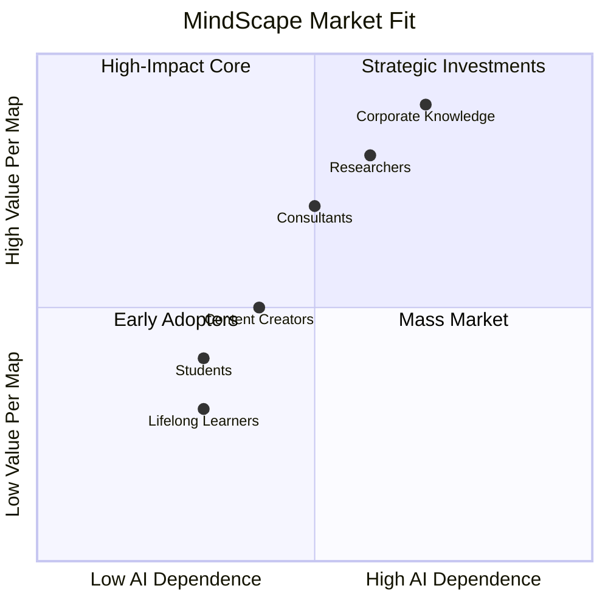

# MindScape — Pitch Deck

## The AI-Powered Visual Intelligence Engine

---

# 🏢 Elevator Pitch

> **MindScape transforms any source of information — PDFs, videos, websites, or text — into interactive, explorable knowledge graphs. It's the fastest way to go from unstructured data to structured understanding.**

---

# 💡 The Problem

| Pain Point | Impact |
|---|---|
| **Information overload** | Professionals spend 60% of reading time just navigating, not understanding |
| **AI hallucinations** | Raw LLM summaries invent facts — dangerous for research & decisions |
| **Flat, unactionable output** | Text summaries are passive. You can't explore, question, or build on them |
| **Siloed sources** | PDFs, videos, notes, websites — each lives in its own disconnected world |
| **No learning feedback loop** | Read once, forget. No built-in testing or reinforcement |

---

# 🚀 The Solution

## MindScape's one-sentence value proposition:

> *Combine deterministic structural extraction with AI synthesis to produce accurate, interactive, and endlessly explorable knowledge maps — from any source, in any language.*

### Core differentiator: **SKEE (Structural Knowledge Extraction Engine)**

Before any AI touches your content, MindScape's deterministic engine extracts headings, sections, keywords, and relationships. This guarantees:

- ✅ **Zero hallucinated headings** — every structure node is grounded in real content
- ✅ **Consistent hierarchy** — no AI-invented sections
- ✅ **High accuracy extraction** — deterministic code, not probabilistic generation

---

# 🎯 Target Markets



### Primary Personas

| Persona | Pain | MindScape Solution | Willingness to Pay |
|---|---|---|---|
| **🎓 Student** | Overwhelmed by dense material | Map → Quiz → Adaptive Deepening → Audio Summary | Low-Medium (freemium) |
| **🔬 Researcher** | Synthesizing 10+ papers | Multi-source ingestion → Compare → Share findings | High (subscription) |
| **💼 Professional / Consultant** | Making decisions under uncertainty | Map → Chat → Action Plan → Export as PDF | High (team license) |

---

# 🧩 Product Features (Vertical View)

## 🏠 Home / Landing

- Single input bar: type a topic, paste a URL, or upload files
- Three modes: **Single** (one topic), **Compare** (two topics), **Multi-Source** (unlimited files)
- Configurable depth (Quick / Balanced / Detailed / Auto) and AI Persona (Teacher / Concise / Creative / Sage)
- 50+ language support

## 🖼️ Canvas / Mind Map

- Hierarchical accordion tree + full-screen radial graph
- Expand/Collapse any branch
- One-click **Explanations** at three levels (Beginner → Intermediate → Expert)
- **Examples**, **Confidence Ratings**, **Micro-quizzes** per node
- **Visual Insight Lab**: Generate AI images for any concept
- **Knowledge Alchemy**: Select 2 nodes → AI fuses them into a hybrid concept
- **Auto-summarization** with text-to-speech audio download

## 💬 Chat Panel

- Streaming AI chat with real-time response display
- **Thought traces** showing AI reasoning
- **Tool calls** display (search, computation)
- **Quiz system** with adaptive difficulty
- **URL auto-scraping** — paste a link, content auto-attaches
- **Voice input** (Web Speech API)
- **Export entire chat as PDF**
- **Pinned messages** sync to mind map

## 🌐 Community & Library

- User profiles with XP ranks (10 tiers from Spark → MindMaster)
- Publish maps to community feed
- Browse, filter, and explore public maps
- Personal library with search and organization

## 🏆 Gamification System

| Action | XP |
|---|---|
| Create mind map | +20 |
| Complete quiz | +15 |
| Daily login | +5 |
| 7-day streak | +30 |
| Image generated | +10 |
| Explanation | +5 |

---

# 🏗️ Architecture Summary

```
[User] → Next.js 16 (App Router) → Server Actions
         ↓
    [SKEE Engine] (Deterministic extraction)
         ↓
    [AI Provider: Pollinations.ai / OpenRouter]
         ↓
    [Schema Validation → mapToMindMapData sanitization]
         ↓
    [Supabase Persistence + Real-time UI]
```

**Stack**: Next.js 16 + TypeScript + Tailwind CSS + Supabase (Auth + DB) + Pollinations.ai

**Key architectural decisions**:

- Deterministic pre-processing before AI (prevents hallucinated structure)
- All AI output sanitized through explicit field mapping (no raw spreads)
- Server Actions as the API layer (no REST API needed)
- Session Storage for client-side state between page navigations

---

# 📊 Key Metrics & Traction

| Metric | Current |
|---|---|
| **Tech Stack** | Next.js 16, Supabase, Pollinations.ai, TypeScript |
| **AI Models** | Flux (images), Qwen (text), Gemini Search |
| **Frontend** | React 19, Framer Motion, Tailwind, Radix UI |
| **Auth** | Email/Password + Google OAuth |
| **Code Quality** | Zero `as any` casts, 100% typed codebase |
| **Security** | Input sanitization, rate limiting, cache lifecycle management |

---

# 🚀 Roadmap

### Current (v1.0)

- ✅ Core mind map generation (text, PDF, image, YouTube, website)
- ✅ Compare mode (side-by-side topic analysis)
- ✅ Multi-source ingestion (combine unlimited sources)
- ✅ Quiz system with adaptive deepening
- ✅ AI chat with streaming responses
- ✅ Community publishing
- ✅ Export (chat PDF, audio summary)
- ✅ XP / Gamification (10 ranks)

### Next (v1.1)

- 🔄 Canvas drawing mode (free-form annotation)
- 🔄 Real-time collaborative maps
- 🔄 Mobile-responsive optimizations
- 🔄 More AI provider integrations

### Future (v2.0)

- 📌 Team workspaces with shared knowledge bases
- 📌 Custom AI model fine-tuning per organization
- 📌 API for third-party integrations
- 📌 Desktop app (Electron/Tauri)

---

# 💰 Business Model

| Tier | Price | Features |
|---|---|---|
| **Free** | $0 | 3 maps/day, basic features, community access |
| **Pro** | $12/mo | Unlimited maps, all personas, priority AI, advanced export |
| **Research** | $24/mo | Multi-source, compare mode, unlimited PDFs, API access |
| **Team** | Custom | Shared workspaces, admin dashboard, SSO, dedicated support |

---

# 🏁 Why Now?

1. **AI is commoditizing** — The differentiator isn't the model, it's the **pipeline that tames the model**. MindScape's deterministic pre-processing + schema-validated output is the moat.

2. **Information overload is worse than ever** — Researchers, students, and professionals are drowning. MindScape is the life raft.

3. **Multi-modal is the future** — PDFs, videos, images, websites, text — MindScape already handles them all in a unified pipeline.

4. **Zero hallucination guarantee** — By extracting structure deterministically *before* AI synthesis, MindScape delivers accuracy that pure-LLM products cannot match.

---

**MindScape — Structure the Unstructured.** 🧠
